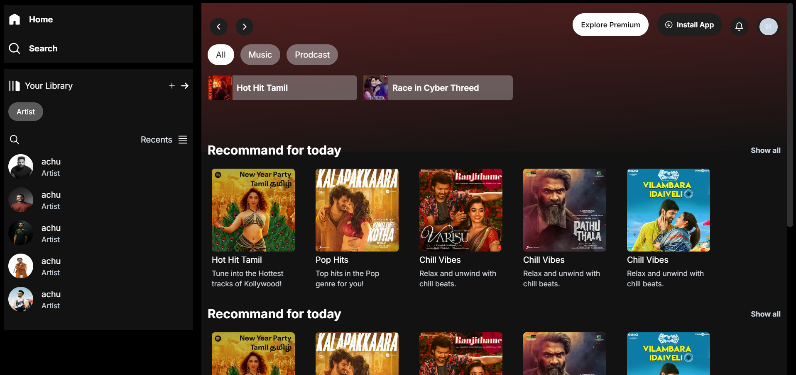

# Spotify Clone

A Spotify clone built using modern web technologies such as React, Next.js, and TailwindCSS. This project replicates the core features and design of the Spotify web app, allowing users to explore and play music with a sleek and responsive interface.

## Tech Stack

- **React**: A JavaScript library for building user interfaces, used to manage the app's dynamic components.
- **Next.js**: A React framework for server-rendered applications and static websites, providing features like routing, server-side rendering (SSR), and static site generation (SSG).
- **TailwindCSS**: A utility-first CSS framework for creating custom designs without leaving your HTML, used for styling the application with flexibility and ease.
 

## Features

- **User Interface**: Responsive design with dynamic components for seamless navigation.
<!-- - **Music Playback**: Functional play, pause, and skip features.
- **Library Management**: Browse and manage playlists, albums, and artists.
- **Authentication**: User login and session management (optional, depending on your implementation). -->

## Installation

1. **Clone the repository**:
    \`\`\`bash
    git clone https://github.com/HARISHKUMAR023/spotify-clone.git
    cd spotify-clone
    \`\`\`

2. **Install dependencies**:
    \`\`\`bash
    npm install
    \`\`\`

3. **Run the development server**:
    \`\`\`bash
    npm run dev
    \`\`\`
    Navigate to `http://localhost:3000` to view the app.

## Project Structure

- **/components**: Reusable React components used throughout the application.
- **/pages**: Next.js pages that map to routes in the app.
- **/styles**: TailwindCSS configuration and custom styles.
- **/public**: Static assets like images and icons.

## Contributing

Contributions are welcome! Please submit a pull request or open an issue to discuss any changes or suggestions.

## License

This project is licensed under the MIT License.
